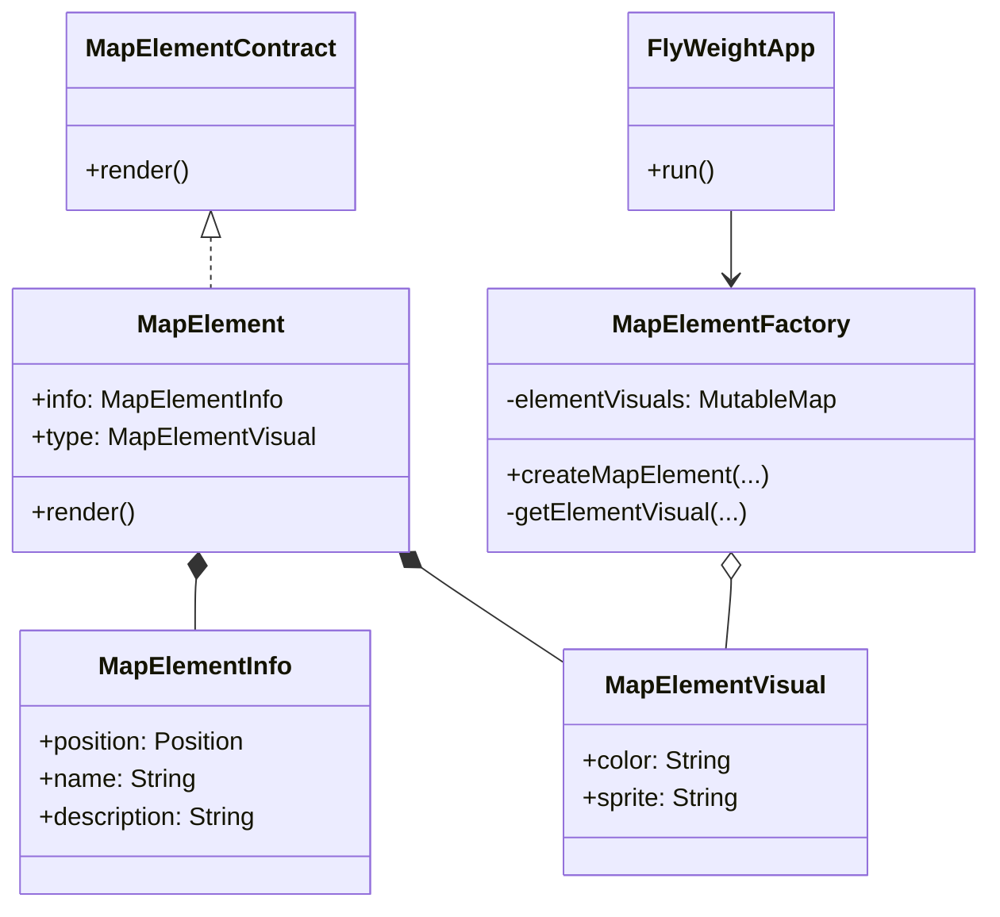

# Exemplo: Renderização de ícones de uma aplicativo de mapas

## Motivação
Imagine que sua equipe está desenvolvendo um aplicativo de mapas onde diferentes localizações (como estradas, prédios, montanhas e lagos) são representadas por ícones visuais. Cada um desses ícones pode ter diferentes cores e informações associadas, dependendo do contexto.

No entanto, quando muitas localizações aparecem simultaneamente, o consumo de memória se torna um problema, pois um grande número de objetos idênticos (como ícones de prédios e estradas) é criado repetidamente. Isso pode levar a lentidão impactando o desempenho da aplicação.

O Flyweight nos ajuda a resolver esse problema compartilhando elementos que são imutáveis e reutilizáveis. Em vez de criar um novo objeto para cada ícone, podemos compartilhar um conjunto fixo de tipos de ícones (intrínsecos) e apenas associá-los a informações variáveis, como posição e nome (extrínsecos).

Isso reduz drasticamente o consumo de memória e melhora o desempenho, pois menos objetos precisam ser alocados na memória.

## UML do FlyWeight

## Código do FlyWeight

### Interface MapElementContract (Interface FlyWeight)
@import "./src/flyweight/MapElementContract.kt"

### Classe MapElement (Classe que implementa a interface)
@import "./src/flyweight/MapElement.kt"

### Classe FlyWeightFactory (Gerencia os objetos)
@import "./src/flyweight/MapElementFactory.kt"

### Classe FlyWeightApp (Cliente)
@import "./src/flyweight/FlyWeightApp.kt"

### **Explicação do Código**  
1. Criamos a interface `MapElementContract`, que define um contrato para os elementos do mapa renderizáveis.  
2. Criamos a classe `MapElementVisual`, que representa a parte compartilhável do objeto (estado intrínseco), contendo informações como cor e sprite.  
3. Criamos a classe `MapElement`, que representa um elemento do mapa e contém informações específicas (estado extrínseco), como posição, nome e descrição, além de uma referência ao `MapElementVisual`.  
4. Implementamos a `MapElementFactory`, responsável por gerenciar os objetos `MapElementVisual`, garantindo que instâncias sejam reutilizadas para evitar desperdício de memória.  
5. No método `createMapElement()` da fábrica, garantimos que `MapElementVisual` seja reutilizado, armazenando-os em um cache (`elementVisuals`).  
6. A classe `FlyWeightApp` simula a criação de milhões de elementos no mapa e monitora o uso de memória antes e depois da aplicação do padrão Flyweight.  

### **Participantes**  

- **Flyweight (Glyph)**  
  Declara uma interface através da qual flyweights podem receber e atuar sobre estados extrínsecos.  
  **→ Implementado por `MapElementContract`**, que define a operação `render()` que cada elemento do mapa deve implementar.

- **ConcreteFlyweight (Character)**  
  Implementa a interface Flyweight e armazena o estado intrínseco que pode ser compartilhado.  
  **→ Representado por `MapElementVisual`**, que contém atributos como cor e sprite, reutilizados por múltiplos elementos do mapa.  

- **UnsharedConcreteFlyweight (Row, Column)**  
  Representa objetos que não precisam ser compartilhados, mas que referenciam objetos Flyweight.  
  **→ Implementado por `MapElement`**, que contém informações individuais (posição, nome e descrição) e mantém uma referência a um `MapElementVisual` compartilhado.  

- **FlyweightFactory**  
  Cria e gerencia os objetos Flyweight, garantindo seu compartilhamento apropriado.  
  **→ Implementado por `MapElementFactory`**, que armazena os elementos visuais em um cache e os reutiliza quando possível.  

- **Client**  
  Mantém referências para objetos Flyweight e fornece os estados extrínsecos necessários para sua operação.  
  **→ Representado por `FlyWeightApp`**, que simula a criação de um grande número de elementos de mapa e avalia a economia de memória resultante da aplicação do padrão.  